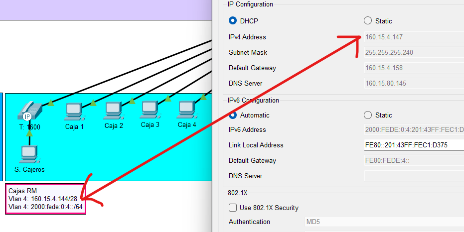
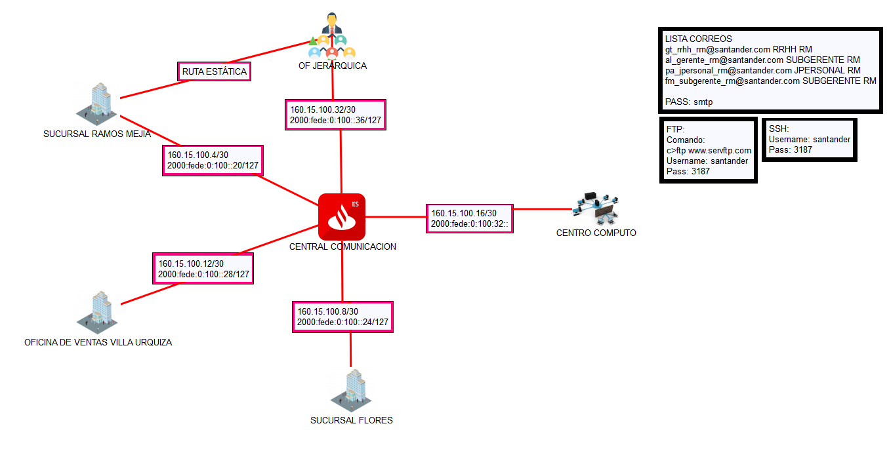
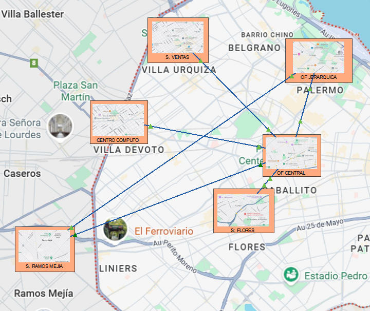

# Simulación de una red bancaria

La simulación incluye: 
 - sucursal en Ramos Mejía
 - sucursal en Flores
 - sucursal en Villa Urquiza
 - Centro de Computo en Devoto
 - Central de comunicación en Caballito
 - Oficina Jerárquica en Palermo  

 > ACLARACIÓN: No tocar el botón (Fast Forward Time  ```  >>```) esperar que las ips las asigne el router de forma automática del tipo 160.15.xxx.xxx.
 En el caso de no seguir esta aclaración la configuración DHCP de los host se desconfigurará.

 #### Ejemplo

  

 ## Dependencias Utilizadas

 - [Edraw-Max](https://www.edrawmax.com) para realizar los planos
 - [Logo Santander](https://www.santander.com.ar/)

 ## Topología 

### Lógica


### Física


## Autor

- [FedericoManzano](https://github.com/FedeManzano)